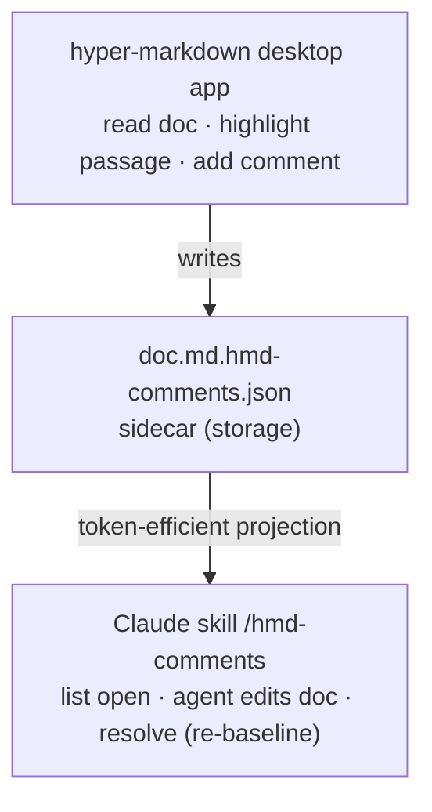

# Agent Steering

Planning doc for the headline use of hyper-markdown: **review a Markdown/MDX
document, leave comments, and feed them to an AI agent to act on — without
duplicating the document into the agent's context.**

This file is also the dogfood target: we annotate *this* doc in the app and use
the workflow below to drive the changes.

---

## The loop



The agent already has the repo (the document *and* the sidecar), so the loop is
designed around **pointing, not quoting**.

---

## Why token-efficiency matters

The sidecar is rich on purpose — it stores `quote`, `prefix`/`suffix`, char
offsets, and a `baseline` (doc hash + anchored source slice) so the app can
re-anchor highlights and detect edits. **None of that should reach the agent.**

Two duplication traps:

1. **Doc ↔ comments.** If the agent already has the document, quoting each
   passage back at it repeats text it already holds.
2. **Raw-sidecar bloat.** Pointing the agent at `*.hmd-comments.json` ingests
   offsets, context strings, hashes, and baseline slices — all redundant.

A stale duplicate is also *dangerous*: an agent may act on a quoted passage that
the live doc has since changed.

**Decision: the sidecar stays as storage; the agent is fed a reference-only
digest** (file + line range + note, no quoted source). One source of truth, no
drift, minimal tokens.

---

## The token-efficient format (the "digest")

Reference-only, grouped by document, with a short id for resolution:

```
Review comments — 2 open

docs/AGENT_STEERING.md
  [3f9a1c2b] L18–20  Spell out the re-baseline rule here.
  [7b2e44d0] L40     This line ref can drift — call that out.

Resolve when addressed:
  node .claude/skills/hmd-comments/digest.mjs resolve <id>
```

- **No quoted source.** The agent opens the file at the line range itself.
- **Short id** = first 8 chars of the comment UUID; resolve accepts any unique
  prefix.
- **`L?`** is shown when a comment has no resolvable source line.

---

## The Claude skill: `/hmd-comments`

Lives at `.claude/skills/hmd-comments/`. It exposes the digest (and the
resolve action) to a Claude agent working in the repo, so the agent never reads
raw sidecar JSON.

| Command | Effect |
| --- | --- |
| `node …/digest.mjs` (or `list`) | Print the digest of **open** comments under the cwd (recurses). |
| `node …/digest.mjs list --all` | Include resolved comments. |
| `node …/digest.mjs resolve <id>` | Mark a comment resolved and **re-baseline** it. |

`pnpm comments` is a convenience alias for the list command.

The sidecar's document is found by stripping `.hmd-comments.json` from the
sidecar filename (robust to the absolute path stored at annotation time).

### Re-baselining on resolve

Resolving sets `status: "resolved"` and updates `baseline.docHash` to the hash
of the *current* document source (matching the app's behaviour). The app's
change-detection fast-path keys on `docHash` equality, so a reopened comment
then reads **untouched** instead of stale-flagging.

---

## Open questions / next

- **Other projections.** Add `inline` (annotated copy of the doc, `{/* */}` for
  MDX / `<!-- -->` for md) and `excerpt` (slices only, omit the full doc) modes
  for agents that *don't* have the document. Reference-only is the default while
  dogfooding with Claude Code.
- **Line drift.** Line numbers can drift if the doc changed since annotation.
  The skill currently trusts stored lines; consider re-resolving by the anchor
  quote (as the app does) before emitting the digest.
